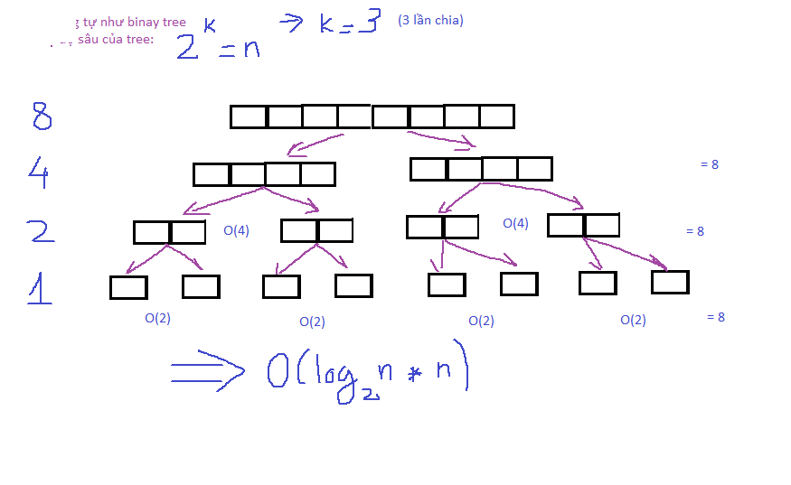

# Sort algorithms

## 1. Lý thuyết

### 1.1 Lý thuyết thuật toán cơ bản

#### Bubble sort
+ Nguyên lý:
  + Chạy từ đầu -> cuối mảng
  + Swap nếu phần tử đứng sau nhỏ hơn phần tử đứng trước

+ Hạn chế:
  + Với trường hợp chỉ có số ít các phẩn tử cần hoán vị, bubble algorithm vẫn sẽ lặp qua tât cả các cặp.
  -> sử dụng cờ check dãy đã đc sắp xếp chưa.

#### Insertion sort
+ Nguyên lý:
  + khi chạy tới phần tử bất kì, ta sẽ thực hiện chèn phần tử đó vào mảng phía trước của nó sao cho sau khi chèn, mảng mới là mảng được sắp xếp.

#### Selection Sort
+ Nguyên lý:
  + Khi chạy tử đầu đến cuối, tại phần tử i, tìm giá trị nhỏ nhất của dãy arr[i + 1, n - 1]. Nếu arr[i] > minValue -> swap(arr[i], minValue)

#### Merge sort
+ Ý tưởng - {chia ra - trộn vảo}
  + chia ra nhỏ nhất có thể
  + trộn vào 2 dãy đã sắp xếp

+ Pseudo code:
```
mergeSort(int[] arr, l, r):
  //      divide
  a1 = mergeSort(arr, l, k);
  a2 = mergeSort(arr, k + 1, r);
  //      merge
  r = merge(a1, a2);
  return r;
```

+ Tính độ phức tạp:
  + Cach 1: 
  
  + Cach 2 (tinh thong qua de quy)

#### Quick sort
+ Ý tưởng:
  + Bước 1: chọn khóa
  + Bước 2: phân bố lại mảng theo khóa
  + Bước 3: Chia ra
  + Bước 4: lặp lại các bước trên


## 2. Lưu ý
+ Xét bubble sort, với các phần tử vòng lặp đầu là _i_, các phần tử vòng lặp sau _j_. Sau khi sorted các phần tử i, mảng chỉ cần xét (n - i - 1) phần tử. Một điểm tối ưu nhỏ:
```
for (int i=0; i < n; i++){
  for (int j=0; j < n - i - 1; j++){
  }
}

```