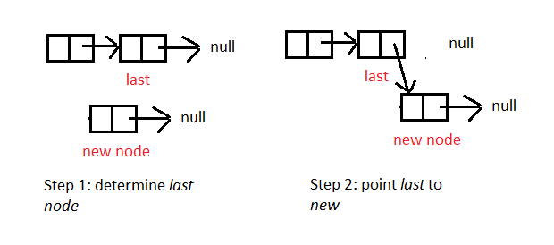

# Linked List

## What is a linked list ?
+ Là chuỗi các nodes sao cho:
  + mỗi node chứa 1 value
  + node này chỉ sang node khác
  + The last node ~ null

## Khi nào sử dụng linked list ? 
+ Sử dụng để implement List, Queue & Stack
+ Tạo ra danh sách vòng, objects như tàu
+ sử dụng để tách chuỗi phục vụ triển khai Hashtable để giải quyết vấn đề xung đột mảng băm.
+ Thường được sử dụng để thực hiện 
+ Sử dụng trong thực hiện danh sách liền kề cho đồ thị

## Thuật ngữ 
+ _Head_: node đầu tiên
+ _tail_: node cuối cùng
+ _pointer_: con trỏ dùng để chỉ tới node khác
+ _node_: node đang xét

## Operations

+ Thêm phần tử vào giữa mảng

+ Thêm phần tử vào đầu dãy

+ Thêm phần tử vào cuối

+ Xóa phần tử ở giữa

+ Xóa phần tử ở đầu

+ Xóa phần tử ở cuối
